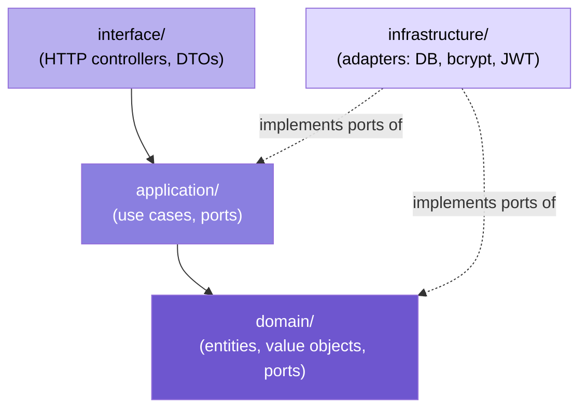
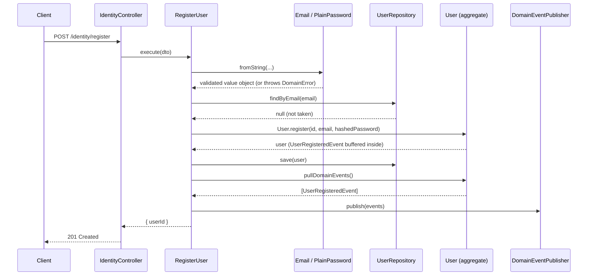
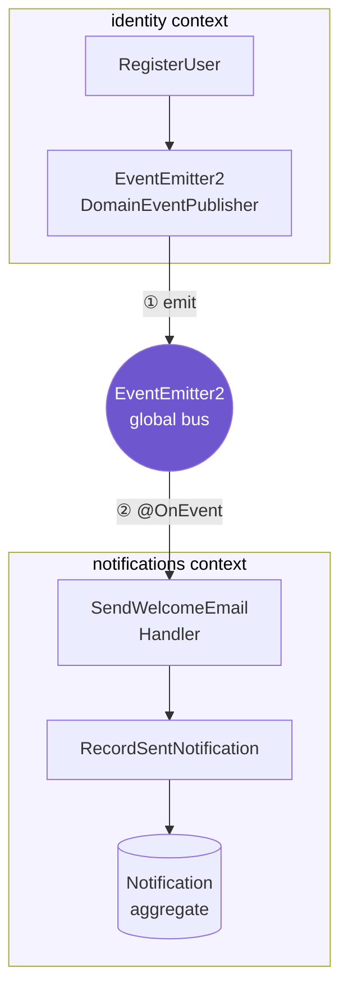

# 🏛️ Architecture walkthrough

Assumes you've read [DDD Concepts](./01-ddd-concepts.md).
This doc covers the folder layout, the rule that keeps layers from tangling,
and then walks you through the `identity` context file by file, in the order you should actually read them.

**On this page:**
[Folder layout](#-folder-layout) ·
[The dependency rule](#-the-dependency-rule) ·
[Reading order](#-reading-order-the-identity-context) ·
[Request trace](#-request-trace-post-identityregister) ·
[Cross-context flow](#-cross-context-flow-how-notifications-reacts) ·
[Error flow](#-error-flow)

---

## 📁 Folder layout

```
src/
├── shared/
│   ├── domain/               base classes every context builds on (Entity, ValueObject, ...)
│   ├── application/ports/    shared-kernel ports (DomainEventPublisher)
│   └── infrastructure/       shared infra: config validation, event bus adapter, HTTP filter
└── context/
    ├── identity/
    │   ├── domain/            business rules: User, Email, ports it needs (UserRepository)
    │   ├── application/       use cases + the ports they need (PasswordHasher, TokenIssuer)
    │   ├── infrastructure/    adapters: in-memory repo, bcrypt, JWT
    │   ├── interface/http/    controller + DTOs
    │   └── identity.module.ts wires it all together for Nest's DI container
    └── notifications/         same four-layer shape, reacts to identity's events
```

## 🧱 The dependency rule

Each layer may only depend on layers "inside" it:



- **`domain/`** depends on nothing else in the app. `User`, `Email`, the
  `UserRepository` port — zero imports from `application`, `infrastructure`,
  or `interface`. This is what makes the business rules testable without a
  database, a server, or NestJS itself running.
- **`application/`** depends on `domain/` only. Use cases call domain objects
  and ports; they don't know if a port is backed by Postgres or a Map.
- **`infrastructure/`** depends on `domain/` and `application/` to
  _implement_ their ports (`InMemoryUserRepository implements UserRepository`).
  This is the only layer allowed to import a concrete library like `bcrypt`
  or `@nestjs/jwt`.
- **`interface/`** (HTTP here) depends on `application/` only — it calls use
  cases, it never touches a repository or the domain model directly.

> 💡 **The whole trick:** infrastructure depends on domain, never the other
> way round. Swap `InMemoryUserRepository` for a real Postgres one later, and
> nothing in `domain/` or `application/` changes.

## 🧭 Reading order: the `identity` context

Read these in order — each step builds on the last.

1. **Shared building blocks** — the vocabulary from doc 1, in code:
   [`src/shared/domain/entity.ts`](../src/shared/domain/entity.ts),
   [`value-object.ts`](../src/shared/domain/value-object.ts),
   [`aggregate-root.ts`](../src/shared/domain/aggregate-root.ts),
   [`identifier.ts`](../src/shared/domain/identifier.ts),
   [`domain-event.ts`](../src/shared/domain/domain-event.ts),
   [`domain-error.ts`](../src/shared/domain/domain-error.ts).

2. **The concrete domain model** —
   [`domain/user/email.vo.ts`](../src/context/identity/domain/user/email.vo.ts),
   [`plain-password.vo.ts`](../src/context/identity/domain/user/plain-password.vo.ts),
   [`hashed-password.vo.ts`](../src/context/identity/domain/user/hashed-password.vo.ts),
   [`user-status.enum.ts`](../src/context/identity/domain/user/user-status.enum.ts),
   [`user.identifier.ts`](../src/context/identity/domain/user/user.identifier.ts),
   then [`user.ts`](../src/context/identity/domain/user/user.ts) — this last one is the aggregate root, it ties the previous four together and owns the
   status state machine.

3. **The event this aggregate raises** —
   [`domain/events/user-registered.event.ts`](../src/context/identity/domain/events/user-registered.event.ts).

4. **The ports** — what the domain/application layers expect infrastructure
   to provide, before you look at who provides it:
   [`domain/ports/user.repository.ts`](../src/context/identity/domain/ports/user.repository.ts),
   [`application/ports/password-hasher.ts`](../src/context/identity/application/ports/password-hasher.ts),
   [`application/ports/token-issuer.ts`](../src/context/identity/application/ports/token-issuer.ts).

5. **The use cases** — the orchestration logic:
   [`application/use-cases/register-user.ts`](../src/context/identity/application/use-cases/register-user.ts),
   [`authenticate-user.ts`](../src/context/identity/application/use-cases/authenticate-user.ts).

6. **The adapters** — concrete implementations of the ports from step 4:
   [`infrastructure/persistence/in-memory-user.repository.ts`](../src/context/identity/infrastructure/persistence/in-memory-user.repository.ts),
   [`infrastructure/security/bcrypt-password-hasher.ts`](../src/context/identity/infrastructure/security/bcrypt-password-hasher.ts),
   [`infrastructure/security/jwt-token-issuer.ts`](../src/context/identity/infrastructure/security/jwt-token-issuer.ts).

7. **The HTTP boundary** —
   [`interface/http/dto/register-user.dto.ts`](../src/context/identity/interface/http/dto/register-user.dto.ts),
   [`authenticate-user.dto.ts`](../src/context/identity/interface/http/dto/authenticate-user.dto.ts),
   then [`identity.controller.ts`](../src/context/identity/interface/http/identity.controller.ts) —
   deliberately thin, it only parses input and calls a use case.

8. **The wiring** —
   [`identity.module.ts`](../src/context/identity/identity.module.ts): this
   is where each port gets bound to its concrete adapter
   (`{ provide: UserRepository, useClass: InMemoryUserRepository }`). This is
   the _only_ file that knows both the port and its adapter at once.

9. **The root composition** —
   [`app.module.ts`](../src/shared/infrastructure/modules/app.module.ts):
   registers config validation, the global event bus, and both contexts.

## 🔄 Request trace: `POST /identity/register`



1. `IdentityController.register` receives the HTTP body, Nest validates it
   against `RegisterUserDto` (transport-shape checks only — field present,
   right primitive type).
2. Controller calls `RegisterUser.execute(dto)` — nothing else, no logic.
3. Inside the use case: `Email.fromString(...)` and
   `PlainPassword.fromString(...)` re-validate at the _domain_ level (a
   stricter rule than the DTO — e.g. password letter+digit policy). A bad
   value throws `DomainError` right here, before any repository call.
4. `userRepository.findByEmail(email)` checks uniqueness — this can't live
   inside the `Email` Value Object itself, because it needs a database
   round-trip, and a Value Object must stay a pure, side-effect-free check.
5. `passwordHasher.hash(...)` hashes the password. Plain text never reaches
   the aggregate or persistence.
6. `User.register(id, email, hashedPassword)` builds the aggregate **and**
   raises `UserRegisteredEvent` internally, buffered on the aggregate — not
   published yet.
7. `userRepository.save(user)` persists it.
8. `domainEventPublisher.publish(user.pullDomainEvents())` — published only
   _after_ save succeeds, so a listener can never react to a user that
   didn't actually get persisted.
9. Use case returns `{ userId }`, controller returns it as the HTTP response.

## 🔗 Cross-context flow: how `notifications` reacts

`notifications` never imports anything from `identity`. The link is the
event, published on Nest's `EventEmitter2` (registered globally by
`EventEmitterModule.forRoot()` in `app.module.ts`):



- ① `eventEmitter.emit('UserRegisteredEvent', event)`
- ② `@OnEvent('UserRegisteredEvent')`

1. `EventEmitter2DomainEventPublisher.publish(...)` (in
   [`shared/infrastructure/events/`](../src/shared/infrastructure/events/event-emitter2-domain-event-publisher.ts))
   emits the event under its class name: `eventEmitter.emit('UserRegisteredEvent', event)`.
2. [`SendWelcomeEmailHandler`](../src/context/notifications/application/event-handlers/send-welcome-email.handler.ts)
   in the `notifications` context listens with `@OnEvent('UserRegisteredEvent')`.
   It calls `event.email.toString()` — the _one_ line in this whole context
   that touches identity's `Email` type — then works with a plain string from
   there on.
3. It calls `RecordSentNotification.execute(...)`, which builds and saves a
   `Notification` aggregate — `notifications`'s own domain, unrelated to
   `identity`'s.

> 💡 Add a third context tomorrow that also wants to react to
> `UserRegisteredEvent` (e.g. an analytics context) — it subscribes the same
> way, and neither `identity` nor `notifications` needs to change.

## 🚨 Error flow

A `DomainError` thrown anywhere (a Value Object, an aggregate's
`transitionTo`, a use case) is caught in exactly one place —
[`DomainErrorFilter`](../src/shared/infrastructure/filters/domain-error.filter.ts),
registered globally via `APP_FILTER` in `app.module.ts` — and turned into an
HTTP 400 with `{ statusCode, message }`. No controller or use case needs its
own try/catch for this.

---

⬅️ Previous: [DDD Concepts](./01-ddd-concepts.md) &nbsp;·&nbsp;
➡️ Next: [Adding a Feature](./03-adding-a-feature.md) — put this all to use.
