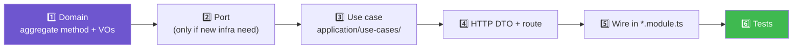

# 🛠️ Adding a feature

Assumes you've read docs 1 and 2. Two recipes: extending an existing context,
and starting a brand new one.

**On this page:**
[Recipe A — new use case](#recipe-a-add-a-use-case-to-an-existing-context) ·
[Recipe B — new context](#recipe-b-add-a-brand-new-bounded-context) ·
[Checklist](#-checklist-before-opening-a-pr)

---

## Recipe A: add a use case to an existing context

Example: "change password" in `identity`. Work outside-in is fine, but the
layers must end up wired inside-out — domain first, so nothing you write
depends on something that doesn't exist yet.



1. **Domain first.** Does this need a new rule on the aggregate? Add a method
   to `User` (e.g. `changePassword(newHashed: HashedPassword): void`) the
   same way `suspend()`/`activate()` exist — it's the aggregate's job to
   decide if the change is legal, throwing `DomainError` if not. Reuse
   existing Value Objects (`PlainPassword`, `HashedPassword`) or add a new
   one under `domain/user/` if the shape is new.
2. **Port, if you need a new one.** Only if the use case needs infrastructure
   the current ports don't cover. Otherwise reuse `UserRepository`,
   `PasswordHasher`, etc. — check `application/ports/` and `domain/ports/`
   before adding a new port.
3. **Use case.** New file under `application/use-cases/`, named after the
   action (`ChangePassword`, not `UserService`) — one class, one `execute`
   method, input/output interfaces above it, same shape as
   [`register-user.ts`](../src/context/identity/application/use-cases/register-user.ts).
   It orchestrates: fetch aggregate via repository, call the domain method,
   save, publish any events pulled with `pullDomainEvents()`.
4. **HTTP DTO + controller route.** Add a DTO under `interface/http/dto/`
   with `class-validator` decorators (transport-shape checks only — real
   rules stay in the Value Objects, don't duplicate them here). Add a
   `@Post`/`@Patch` route on the existing controller calling
   `changePassword.execute(dto)`.
5. **Wire it.** Add the new use case class to `providers` in
   `identity.module.ts`. If you introduced a new port, bind it there too:
   `{ provide: NewPort, useClass: ConcreteAdapter }`.
6. **Tests.** Colocated `*.spec.ts` next to each new file (Value Object,
   aggregate method, use case) — that's what `pnpm test` picks up (rootDir
   `src`, pattern `*.spec.ts`). Unit-test the use case against
   `InMemoryUserRepository`, no real DB needed. Add an e2e case in
   `test/identity.e2e-spec.ts` if it's a new HTTP route.

## Recipe B: add a brand new bounded context

Example: a `billing` context. Same four-layer shape as `identity`:

```
src/context/billing/
├── domain/
│   ├── <aggregate>/     entities + value objects
│   ├── ports/            repository interfaces the domain needs
│   └── events/            domain events this aggregate raises
├── application/
│   ├── ports/              non-repository ports (external services)
│   └── use-cases/
├── infrastructure/
│   └── persistence/         repository implementations
├── interface/http/
│   ├── dto/
│   └── billing.controller.ts
└── billing.module.ts
```

1. Start at `domain/` — model the aggregate using `AggregateRoot`,
   `ValueObject`, `Identifier` from `src/shared/domain/`, same as `User` does.
   Define any repository/port interfaces this context needs.
2. Build the use cases in `application/`, calling only `domain/`.
3. Implement the ports in `infrastructure/` — an in-memory repository is
   fine to start, same pattern as `InMemoryUserRepository`.
4. Add the HTTP boundary in `interface/http/`.
5. Create `billing.module.ts`, binding each port to its adapter in
   `providers`, same shape as `identity.module.ts`.
6. Register the module: add `BillingModule` to the `imports` array in
   [`app.module.ts`](../src/shared/infrastructure/modules/app.module.ts).
7. If this context needs to react to another context's events (or raise its
   own for others to react to), follow the pattern in
   [`send-welcome-email.handler.ts`](../src/context/notifications/application/event-handlers/send-welcome-email.handler.ts) —
   `@OnEvent('SomeEvent')`, translate the foreign type to a primitive
   immediately, never import the other context's domain classes beyond that
   one crossing point.

---

## ✅ Checklist before opening a PR

- [ ] Every Value Object validates itself in its `fromString`/factory — no
      invalid instance should be constructible.
- [ ] Business rules throw `DomainError`, never a bare `Error` (or the
      global filter won't map it to a 400).
- [ ] No `infrastructure/` import inside `domain/` or `application/`.
- [ ] No import of another context's `domain/` or `application/` types
      outside of a single, obvious boundary-crossing line (event handler,
      DTO mapping).
- [ ] New files have a colocated `*.spec.ts`.
- [ ] `pnpm lint && pnpm test && pnpm test:e2e && pnpm build` all pass
      locally — same checks CI runs, see
      [CI & Commits](./04-ci-and-commits.md).

---

⬅️ Previous: [Architecture Walkthrough](./02-architecture-walkthrough.md) &nbsp;·&nbsp;
➡️ Next: [CI & Commits](./04-ci-and-commits.md)
